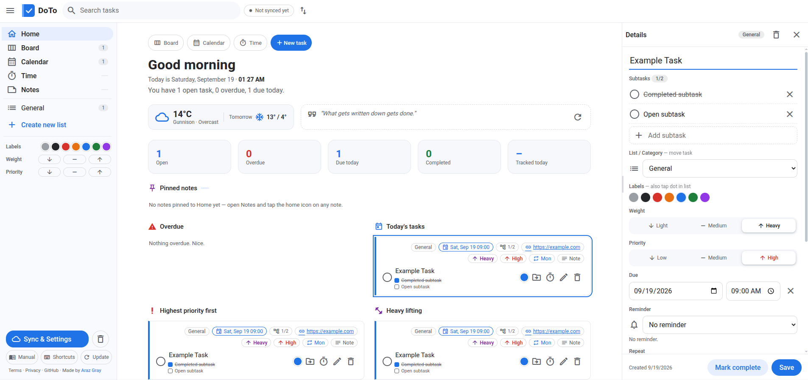

# DoTo — Task Manager, Simple.

*Yet another todo app? Really? No — this is what I needed, and I wrote it for myself. Use it or leave it, it's up to you.*
- Made by someone who actully uses a ToDo app.



A Google Tasks-style task manager with superpowers. 100% vanilla HTML/CSS/JS —
no dependencies, no build step, no framework. Mobile-first and fully responsive,
with full touch + mouse parity.

**Simple, fast, powerful, privacy-first and offline — hosted on GitHub, synced
with your own Google Drive.**

**Live app: <https://arazgray.github.io/doto/>**

## Run it

Open `index.html` directly in a browser, or serve the folder:

```
python3 -m http.server
```

## Sync & Settings (Google Drive, no backend)

Local-first + Drive merge: sign in from the blue **Sync & Settings** button
(sidebar bottom) or the navbar status pill. Synced file lives in Drive's
hidden `appDataFolder`. Per-item three-way merge against the last synced
snapshot (`doto-sync` in localStorage); both-sides-edited items resolve
newest-wins with a toast. Auto-push (8s debounce) + pull on load, focus and
reconnect. Details in [MANUAL.md](MANUAL.md#sync-and-settings).

Ships with the app's own Google OAuth client ID — just press Sign in.
(Repo forks need their own ID: set `GOOGLE_CLIENT_ID` in `app.js`, with the
Drive API enabled and the site's origin added.)

## Install as app (PWA)
Served over HTTPS (e.g. `https://arazgray.github.io/doto/`) the app is
installable and works offline:

- **Desktop Chrome / Edge** — open the site, then *Install DoTo…* from the
  address bar (or ⋮ menu → *Save and share → Install*).
- **Android Chrome** — ⋮ menu → *Add to Home screen* / *Install app*.
- **iPhone / iPad** — Share → *Add to Home Screen* (uses the touch icon +
  standalone display; requires hosting over `http(s)`, not `file://`).

Installability is provided by `assets/manifest.webmanifest` + `sw.js` (offline app
shell). Plain `file://` usage still works, minus install/offline.

## Features

**Views**

- **Home** — action toolbar (Board / Calendar / Time / New), personalized
  greeting, stat cards (open / overdue / due today / completed /
  tracked today), live weather + daily quote, and sections: Overdue, Today's
  tasks, Most important first, Heavy lifting.
- **List** — a single category with an add bar, quick-add presets (due date,
  weight, importance, color), and a collapsible Completed section.
- **Board** — one column per list (kanban style): add tasks per column, drag
  tasks between columns, collapse completed per column, reorder columns.
- **Calendar** — Monday-first month grid with task chips, a Year view of 12
  mini-months, a selected-day agenda with its own add box, and drag a task
  onto a day to reschedule.
- **Time tracker** — searchable task picker with per-task totals, a stopwatch
  (play / pause / stop) that survives page reloads, and logged time records
  grouped by Today / Previously.

**Tasks**

- Colors (7) with renameable labels (Sync & Settings → Color labels),
  Weight (light / medium / heavy), Importance (low / medium / high)
  — all inline-editable from the row via popups, and filterable.
- Due date + time with overdue / today badges; recurrence (daily, weekly with
  weekday picker, monthly, yearly, or custom "every N") — completing a dated
  recurring task schedules the next occurrence, subtasks reset.
- Subtasks with progress badge, notes, and external reference (URL opens in a
  new tab; anything else — ticket #, file path — just shows as a badge).
- Inline rename (double-click title), details panel for everything else.
- Drag & drop everywhere: reorder tasks, move between lists (list view, board
  columns, sidebar), reorder lists. Mouse uses HTML5 DnD, touch uses the drag
  handle (long-press for lists).

**Everything else**

- Search + color/weight/importance filters apply across all views, with clear
  chips shown on every view. Sort by My order / Date / Importance & weight / Title.
- Light & dark theme (persisted; toggled in Sync & Settings, `d` key, or palette).
- Sync & Settings dialog: Google account, your name (used in greetings),
  display toggles, color labels, Import/Export, sync history log.
- Forced updates: sidebar → Update wipes the offline cache and reloads the
  newest release; the app also auto-detects new releases (`version.json`)
  and offers a one-tap Update.
- Resizable sidebar and details panel on desktop (persisted).
- Undo toasts for destructive actions (delete task/list, clear completed,
  time-record delete, duplicate cleanup).
- RTL-friendly: all user text uses `dir="auto"`.

## Keyboard shortcuts

Full map in [MANUAL.md](MANUAL.md#keyboard-shortcuts) (or press `?` in the
app). The highlights:

| Keys | Action |
| ---- | ------ |
| `Ctrl+K` / `Cmd+K` | Command palette (commands, lists, tasks) |
| `/` | Focus search |
| `n` | New task |
| `j` / `k`, `Enter`, `x`, `Del` | Select, open, complete, delete |
| `g` then `h` / `b` / `c` / `t` | Go Home / Board / Calendar / Time |
| `g` then `1`–`9` | Jump to list by position |
| `u`, `d`, `?`, `Esc` | Completed visibility, dark mode, help, close |

## Import / Export

- **Export** — Sync & Settings → *Export*: `doto-export-YYYY-MM-DD.json` including
  lists, tasks, and time records.
- **Import** — multi-select `.json`, accepts:
  - DoTo native exports (appended as new lists)
  - Google Takeout Tasks — full backup (`tasks#taskLists`), per-list files
    (`tasks#tasks`), or bare task arrays
  - Google mapping: title/notes, status→done, `scheduled_time`/`due`→date+time
    (read as-written, no timezone shift), `starred`→high importance,
    `links[0]`→external ref, `parent`→subtasks, and recurring instances are
    collapsed to a single task carrying the repeat rule.

## Data & persistence

Local-first in `localStorage` — no DoTo server. Optional Google Drive sync
(see above) keeps an encrypted-in-transit copy in Drive's hidden app folder:

- `doto-v1` — app state: `{ lists, tasks, times, timer, activeView,
  showCompleted, filters, colorNames, userName, prefs, dirtyAt }`
- `doto-sync` — sync metadata: `{ fileId, base, lastSyncedAt, auto, email, token }`
- `doto-sync-log` — recent sync events (max 50)
- `doto-theme` — `'dark' | 'light'`
- `doto-loc` — weather coordinates (7-day TTL)
- `doto-google-client-id` — per-browser OAuth client override (only for forks)

Task fields: `{ id, listId, title, notes, date, time, extRef, color, weight,
importance, recur, recId, done, completedAt, order, createdAt, subtasks }`.

Privacy note: the Home weather card fetches from Open-Meteo / BigDataCloud /
ipapi.co; Google sign-in loads Google Identity Services and, when syncing,
talks to the Drive API. Nothing else ever leaves the browser.

Corrupted saves are detected on load: the raw data is stashed under a
`doto-v1-corrupt-<timestamp>` key and the app starts fresh instead of breaking.

## Manual & wiki

- The user manual lives in [MANUAL.md](MANUAL.md) and is rendered in-app at
  [`manual.html`](https://arazgray.github.io/doto/manual.html) (sidebar →
  **Manual**).
- It is also published on the **[GitHub wiki](https://github.com/arazgray/doto/wiki)**.
  After editing `MANUAL.md`, re-publish from the nested clone:
  ```
  cp MANUAL.md doto.wiki/Home.md
  git -C doto.wiki add Home.md && git -C doto.wiki commit -m "Update manual" && git -C doto.wiki push
  ```
  The sidebar Manual button points at the in-app page, which never 404s.

## Project layout

```
index.html   — shell: topbar, sidebar, 5 views, detail panel, popups, dialogs
               (palette, shortcuts help, sync & settings, sync history), toast.
               Assets carry `?v=1.0-<ts>` cache-busters (bump on every release).
styles.css   — native nested CSS, CSS variables theming, dark mode via body.dark.
               Mobile compact rules live last in file (equal-specificity overrides).
app.js       — all logic (~2700 lines), vanilla JS. Release trio: ?v= stamps,
               APP_VERSION, version.json — always the same `1.0-<ts>`.
sw.js        — offline shell + update detector bypass for version.json (stays in
               root: SW scope is limited to its own directory)
assets/      — manifest.webmanifest + icon-*.png/svg (PWA install assets)
MANUAL.md + manual.html — user manual (Markdown source + offline reader, linked from sidebar)
doto-demo.json — screenshot/demo dataset (dates go stale; regenerate on demand)
version.json — release marker polled by the in-app update detector
```

Conventions: no emojis in code, no `prompt()`/`confirm()` (in-app modal
instead), mobile-first CSS (compact rules ≤600px, breakpoints 700px / 1024px),
`?v=1.0-<ts>` asset stamps bumped on every release (see trio above).

## License

MIT — see [LICENSE](LICENSE).
